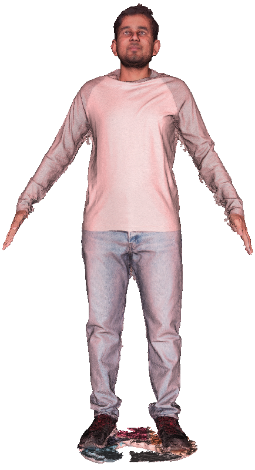
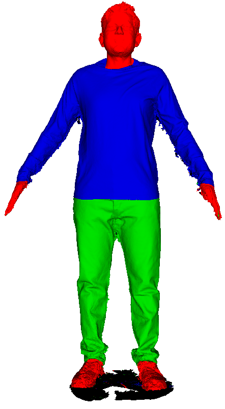
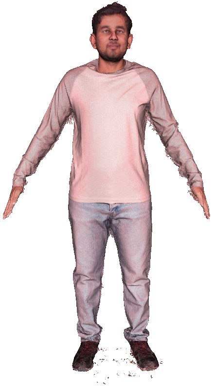
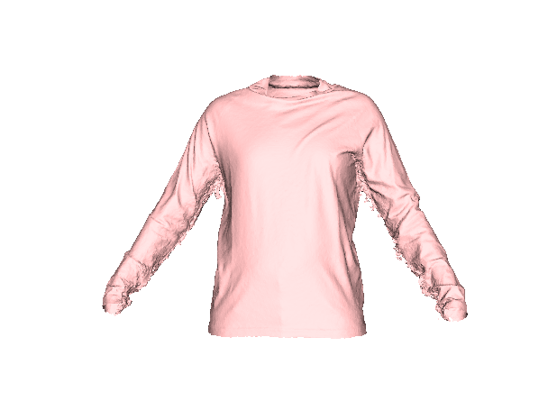
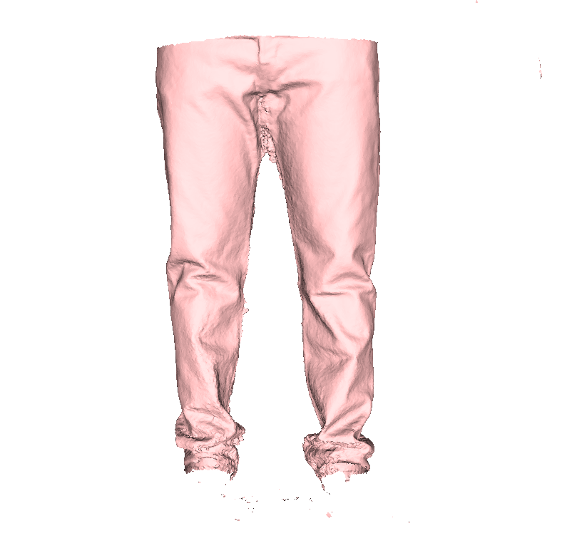
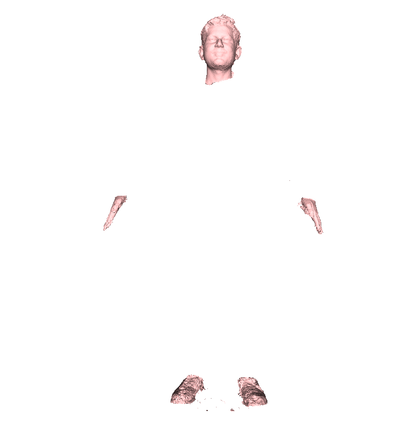

## SIZER Dataset Repository
 

### Download Dataset 
    https://nextcloud.mpi-klsb.mpg.de/index.php/s/nx6wK6BJFZCTF8C/authenticate/showShare
Fill this [form](https://docs.google.com/forms/d/e/1FAIpQLSddBep3Eif1gI-6IhaZybBDoR-_H_QW1NST0JV5vviauvPNTA/viewform)
### For dataset access

1. Fill this [form](https://docs.google.com/forms/d/e/1FAIpQLSddBep3Eif1gI-6IhaZybBDoR-_H_QW1NST0JV5vviauvPNTA/viewform)
2. For password, send an email to: gtiwari@mpi-inf.mpg.de

### Installation and Datafiles:
    Check INSTALL.MD

## Visualize and process data

### Visualize scan and clean floor noise
    python vis_data/scan_visualise.py --scan=<subjectid>/<scanid> --process remove_floor

This script only visualises original scan and cleaned scan and saves the clean mesh in the same data directory
subjectid = {10001, 10005 ....... }
scanid = {1937.....} (for 10001)

Output

  
&nbsp; &nbsp; &nbsp; &nbsp;
  
&nbsp; &nbsp; &nbsp; &nbsp;
  

  Original Scan
&nbsp; &nbsp; &nbsp; &nbsp;
  Segmentation Labels
&nbsp; &nbsp; &nbsp; &nbsp;
  Clean Scan

### Visualize segmented garment layers

    python vis_data/get_garment.py --scan=<subjectid>/<scanid>

Output

  
&nbsp; &nbsp; &nbsp; &nbsp;
  
&nbsp; &nbsp; &nbsp; &nbsp;
  

  Original Scan
&nbsp; &nbsp; &nbsp; &nbsp;
  Segmentation Labels
&nbsp; &nbsp; &nbsp; &nbsp;
  Clean Scan

This script only visualises original scan and 3 layers of segmented scan, namely upper garment, lower garment and other.

### Visualize registration

    python vis_data/visualise_registration.py --scan=<subjectid>/<scanid>

Note: Before using/comparing scans and registrations, align scan, using align_scan() in visualise_registration.py 

### Evaluate registration

    python vis_data/visualise_registration.py --scan=<subjectid>/<scanid>

If you have your own code/method for scan registrations, we here provide a code to evaluate the quality of registration. 
## Others

We here provide code for using/evaluating SIZER dataset for various tasks such as 3D reconstruction from images, scan fitting etc.

### Image based reconstruction
For image based reconstruction, SIZER scans can be rendered and data pair of {image, scans, SMPL params} can be generated for training or evaluation.

#### Rendering using fixed camera views:
    python image_recon/pytorch_renderer.py --mesh_path=<obj_file> --out_dir=<out_dir>

#### Rendering image, depth and normal
    python image_recon/image_renderer.py --mesh_path=<obj_file> --out_dir=<out_dir>

<obj_file> should contain <>.obj and <>.jpg in the same folder with same name. Currently we render from 72 fixed views, This can be changed in create_rotmat() function in image_recon/render_utils.py

#### Creating data pairs:
    Coming Soon

### Citation:
    @inproceedings{tiwari20sizer,
        title = {SIZER: A Dataset and Model for Parsing 3D Clothing and Learning Size Sensitive 3D Clothing},
        author = {Tiwari, Garvita and Bhatnagar, Bharat Lal and Tung, Tony and Pons-Moll, Gerard},
        booktitle = {European Conference on Computer Vision ({ECCV})},
        month = {August},
        organization = {{Springer}},
        year = {2020},
        }
